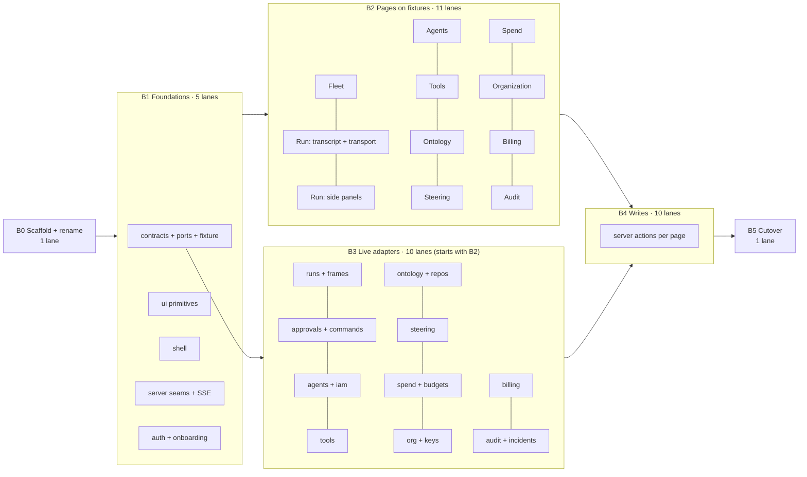

# Oxagen Mission Control app: implementation plan

| | |
|---|---|
| **Status** | Draft |
| **Date** | 2026-09-12 |
| **Owner** | Mac Anderson |
| **Builds** | a new `apps/app` (`@oxagen/app`) in `~/Projects/oxagen`; today's app moves to `apps/app_deprecated` (`@oxagen/app-deprecated`) |
| **Source** | `2026-09-11-oxagen-mission-control-spec.md` (§3, §4, §14, §15, §19, App. A, B, F) · mockups `~/Documents/Oxagen/Mockups` (`mc.html` @ tag `mc-baseline-w3`, W1–W12) · `docs/feedback-mockups.md` · the repo at `origin/main` |
| **Optimised for** | parallel agents: every lane owns a disjoint set of paths, and every batch lists what it waits on |

---

## 0. Decisions in one place

| # | Decision | Why |
|---|---|---|
| 1 | `git mv apps/app apps/app_deprecated`, rename its package to `@oxagen/app-deprecated`, and create a fresh `apps/app` that keeps the package name `@oxagen/app`. | Deploy keys on the **package name** (`pnpm --filter @oxagen/app build`, `pnpm deploy --filter @oxagen/app`, matrix `service: app`), on the **path** `apps/app` (`package-for-node.sh:159 assemble_next apps/app`), and on port 3000 (Caddy `app.oxagen.sh → 127.0.0.1:3000`). The new app satisfies all three, so the deploy is untouched. |
| 2 | Build on an integration branch `app-rebuild`. Batch PRs target it; one cutover PR (Batch 5) lands it on `main`. | Deploy runs from `main`. Landing the swap early would put a half-built app on `app.oxagen.sh`. The branch is the only thing that keeps "no deploy change" and "no production regression" both true. |
| 3 | Every read goes through a **port** (`src/data/ports.ts`) with two adapters: `fixture` (the mockup's data, typed and integrity-checked) and `live` (today's tables through the kernel, run-ledger, tacho, ClickHouse). A port method with no backing store returns `NotBacked` and the page renders an honest "not recorded yet" state. | Of the 68 page-data slices mapped in §3, 22 have no store today, 27 are partial and only 19 are fully backed. Pages must not wait for M2–M6, and production must never show fixture data or a number stronger than what was recorded (spec §14 interaction rules). |
| 4 | Every write is a server action that calls kernel `invoke()` through **one seam** (`src/server/invoke.ts`), which parses the contract's output schema. | Spec §14.1: one agent tool contract drives API, MCP, CLI and UI. The ui-parity gate already checks this. Today's `invokeOrgCapability` casts `as Promise<T>`; the new seam validates instead. |
| 5 | Tabs are URL segments through optional catch-alls (`tools/[[...tab]]`); the default tab renders in place and never redirects. | Deep links in the mockups (`#/a-intel/core-platform/tools/connections`). Under `cacheComponents`, a bare parent `redirect()` after `await params` 500s. |
| 6 | Pages are Server Components. Client islands only for the transport (player), approval countdown, dialogs, the command menu, the assistant flyout and list controls. Live data arrives over one SSE route with a `run_seq` cursor. | The run ledger already exposes `readAttemptEventsSince(runId, afterRunSeq, limit)`, a resumable cursor that maps directly onto `Last-Event-ID`. |
| 7 | All interface prose lives in `messages/en.json` (ICU) via `next-intl`, without locale routing. | Spec §15 "Language": no hard-coded prose, ICU MessageFormat, English source, RTL-ready. Today's app has no catalog, so doing it from line one is cheaper than retrofitting. |
| 8 | Money on the wire is `{ micros: string, currency, basis }`. Formatting happens only in `<Money>`. | Spec App. A: money is bigint micro-USD. The mockup stores `"2,450.00"`-style strings, which silently zero under `parseFloat`. |

---

## 1. Toolchain: latest stable, verified against npm on 2026-09-12

| Tool | Pin | Notes |
|---|---|---|
| Node | **24.21.0 LTS** (`.nvmrc` stays `24`) | 26.8.2 is *Current*, not LTS. Production runtimes pin LTS. Root `engines.node >=24` already matches. |
| pnpm | 11.7.0 (unchanged) | 12.4.1 exists. A package-manager major is a monorepo-wide change and does not belong in an app rebuild. |
| next / @next/eslint-plugin-next / @next/playwright | **16.3.5** | Published 2026-09-11 17:26 UTC. It clears pnpm's one-day `minimumReleaseAge` from 17:26 UTC today. |
| react / react-dom / @types/react / @types/react-dom | **19.3.0** | |
| TypeScript | **7.0.2** as `@typescript/native` (provides `tsc`), plus `typescript` → `npm:@typescript/typescript6@6.0.2` (provides the JS API and `tsc6`) | TS 7 ships no `lib/typescript.js`. typescript-eslint 8.70 peers `typescript <6.1.0`. Next 16.3 runs the project-local `tsc` CLI by default (`experimental.useTypeScriptCli`), so builds stay on TS 7. |
| eslint / @eslint/js | **10.10.0 / 10.0.1** | `eslint-config-next` is **not** used: it hard-depends on eslint-plugin-react / jsx-a11y / import, which are capped at ESLint 9. |
| typescript-eslint | **8.70.0** | `projectService: true`. Type-aware rules finally run in a Next app (today's `eslint.next.mjs` has none). |
| @eslint-react/eslint-plugin · eslint-plugin-react-hooks | **5.19.0 · 7.1.1** | Replace eslint-plugin-react; hooks v7 carries the React Compiler rules. |
| Accessibility | **@axe-core/playwright 4.13.0** in e2e, **@storybook/addon-a11y 10.6.0** in stories | No ESLint 10 release of jsx-a11y exists. Axe on rendered pages is the stronger gate anyway. |
| tailwindcss / @tailwindcss/postcss | **4.3.3** | |
| zod | **4.6.2** for the app's own view models | Contracts in `@oxagen/oxagen` stay on zod 3.25. The app imports contract *types* and calls `contract.input/output.parse`; it never mixes schema objects across versions. |
| next-intl · nuqs | **4.14.4 · 2.10.1** | |
| better-auth · drizzle-orm | 1.6.11 · 0.45.2 (**match `@oxagen/auth` / `@oxagen/database`**) | The app consumes the packages, not the libraries. Bumping better-auth to 1.7.4 is a `packages/auth` change. |
| vitest / @vitest/coverage-v8 · vite · @vitejs/plugin-react · jsdom | **5.0.0 · 8.3.0 · 6.1.1 · 30.0.1** | The app runs Vitest itself through turbo `test:unit`. Remove `apps/app/vitest.config.ts` from the root `vitest.workspace.ts`, which is on Vitest 2.1.9. |
| @playwright/test | **1.63.0** | `ci-image.yml` reads this pin from `apps/app/package.json`, so the CI image rebuilds once. Expected. |
| @testing-library/react · dom · user-event · jest-dom | 16.3.3 · 10.4.1 · 14.6.7 · 7.0.1 | |
| storybook / @storybook/nextjs-vite | **10.6.0** | |
| lucide-react · @base-ui/react · motion | 1.45.0 · 1.8.0 · 13.2.0 | Icons are Lucide, never emoji. Base UI 1.8 must match `@oxagen/ui`'s 1.5 at runtime. Bump `packages/ui` in the same batch or keep 1.5.0 in the app. |

---

## 2. Evaluation: the wireframes

### 2.1 What is ready to build from

- **Coverage is complete.** Spec §19 lists every page, panel, dialog and flow with the states each needs (loaded, empty, loading, error, denied, phone), and every row links to a mockup.
- **One demo record everywhere** (Anderson Intelligence Corp. / `core-platform` / Marcus Bell). It becomes the fixture adapter's seed.
- **Errors are specified.** Each page has a named error code (Fleet `503 run_index_unavailable`, Run `502 frame_store_unreachable`, Agents `503 iam_principals_unavailable`, Mandate `503 mandate_ledger_unavailable`, Tools `503 tool_registry_unavailable`, Ontology `504 graph_read_timeout`, Steering `503 record_index_unavailable`, Spend `504 rollup_rebuild_in_progress`, Organization `503 control_plane_unavailable`, Billing `502 stripe_unreachable`, Audit `503 audit_store_unavailable`). Each also has a named denied permission. These become the `PageState` contract (§4.8).
- **Interaction rules are stated once.** Trust badges show the recorded value and nothing stronger; money shows its basis; explanations are chains of links.

### 2.2 What must be settled before or while building

| # | Finding | Impact | Resolution in this plan |
|---|---|---|---|
| W1 | **The design baseline was split across branches** (resolved). Agent IAM was on `main` (54f9107; the 1b0634c first named here is an unmerged `worktree-audit-fix` commit). `approvalCardSm` and the flyout were on `small-approvals-bottom-dock-scenarios` (3f345d5, which merged the flyout as PR #1). `runMetrics(R)` was only in the `Specs/mockups/mc.html` scratch copy. | Twenty lanes reading "the mockup" would build three different apps. | **Baseline = tag `mc-baseline-w1`: one `mc.html` with Agent IAM + small approval card + sidebar flyout + `runMetrics` instruments.** Read it with `git show mc-baseline-w1:mc.html`; `tools/baseline/README.md` records what each decision came from, and `tools/baseline/check-baseline.mjs` checks it in a browser. Every lane prompt names the tag, never a branch or the Specs scratch. Where a W file or an older branch disagrees, the baseline wins (w2 and w3 still carry the bottom dock). Superseded by `mc-baseline-w2` (2026-09-13), which adds the W1–W11 parity work and the a-intel dataset, and by `mc-baseline-w3` (2026-09-13, PR #12), which makes every run's tool calls a subset of its agent's belt at registry versions. Lanes read the newest tag; `tools/baseline/README.md` lists them. |
| W2 | **`docs/feedback-mockups.md` items are in no mockup:** (1) approvals render first and collapse when empty; (2) the onboarding content floats right; (3) one-thumb mobile navigation; (4) LLM-generated run name and summary, plus a file-diff card under approvals; (5) run cost large, near the run name, basis in a dialog; (6) prompt shown inspectable but collapsed; (7) run outputs (PRs, files, media) as the story; (8) spend by operator, agent and run on Fleet. | These change the Run and Fleet pages. | In scope: 1, 2, 5, 6, 8 (clear enough to build). 4's UI is in scope; the classifier that writes `run.name`/`run.summary` is a backend gap (G14). **3 and 7 need a design decision.** Their lanes build behind a component seam (`<MobileNav>`, `<RunOutputs>`) with a plain first version, so the design can drop in later. |
| W3 | **Vocabulary drifts from the spec.** Replay grade: mockup `full/partial/digest/ledger` vs spec `inspect/view/fork/retry`. Egress: `third_party/internal/none` vs `local/org_tenant/third_party`. Schema origin: `observed` vs `observed_proposed/observed_approved`. Financial: `fin: moves_funds/commits_spend` vs `consequence_tags text[]`. Agent status `enrolled` vs `unenrolled/active/suspended/retired`. Verdict `null` vs `none`. Record kinds: 6 in the mockup (from Stella's `RecordKind`) vs "twelve kinds" in spec §3. | Types built from the mockup would diverge from the target schema on day one. | **View-model enums follow the spec (App. A).** The fixture adapter maps mockup values once, in one file. Record kinds: use the six real kinds; flag the spec's "twelve" as a spec defect to fix. |
| W4 | **Fixture data has integrity defects.** `EVIDENCE` references agent `a-intel.finops.cost-reporter`, which is not in `AGENTS`. `FIX["Refetching a stable list"]` carries the cache-write finding's text. Several `NOTIFS`/`INCIDENTS`/`RECEIPTS` run ids are not in `RUNS`. `FRAMES` is one list shared by every run. The Mandate page always renders `MANDATES[0]`. | Ported naively, links 404 and every run shows the same frames. | The fixture adapter validates referential integrity in a unit test that **fails on a dangling id** (mutation-test it by deleting one agent). Frames are keyed by run. |
| W5 | **Data is hard-coded in the mockup's markup:** the agent toolbelt rows, the mandate ledger rows, Steering's effect and retirement rows, the funding routes table, the assistant transcript. | No collection to type from. | Types come from spec App. A (`iam.role_grants`, `tools.mandate_ledger`, `org.organizations.model_routes`) instead. |
| W6 | **`kindBadge` was declared twice** in `mc.html`; the later role badge silently replaced the record-kind icon badge on Steering. The baseline renames the role one `roleKindBadge`, and `tsec` had the same collision (fixed by deleting the loose parser). | A defect in the mockup, not intent. | The React components are `RecordKindBadge` and `PrincipalKindBadge`, module-scoped, so the collision cannot recur. Steering uses the icon badge. |
| W7 | **Features in the mockup with no spec table:** agent trust/spend `SCORES`, auto-approval rules `AUTORULES` (Tools › auto), the Org › roles editor with `PERMS`. | Planned, but with no store. | Built UI-first behind `NotBacked`. SCORES and AUTORULES are gaps G11/G12; they need a spec decision on whether they are columns on `iam.role_grants.conditions` or new tables. |
| W8 | **About 60 write interactions are toast-only in the mockup.** | They have no payload contract. | §3 maps each write to an existing capability or to a gap. |
| W9 | **The assistant's "engine down" state is unreachable** (nothing sets `S.asstEngine="down"`). | Spec §18 requires every screen to work with the engine down. | The flyout reads engine health from the port; e2e covers the down state. |

---

## 3. Evaluation: the data mapping

Legend: **✅ backed today** (possibly under a different name) · **🟡 partial** (some fields, or derivable with work) · **❌ no store** (fixture in dev, `NotBacked` in production).
Status comes from table and contract names in the repo. **Batch 3 lanes must confirm each ✅/🟡 at column level before wiring it.**

### 3.1 Workspace pages

| Page · data | Mockup collection | Target (spec) | Today (repo) | Status |
|---|---|---|---|---|
| **Fleet** · runs list | `RUNS` | `:Run` + `cost.run_totals` | `agent.agent_runs` (+attempts, seals) via `@oxagen/run-ledger` `RunStore`; wrapped agents in `tacho.sessions`; cost from ClickHouse `token_usage` | 🟡 status/turns/steps ✅; tier, replay grade, verdict, proven spend ❌ |
| Fleet · approvals panel | `APPROVALS` + `S.ap` | `control.approvals` | `agent.approval_requests`; `resolve_approval` | ✅ request/decision · 🟡 four-hop chain (rules, taint, mandate ❌) |
| Fleet · spend by operator / agent / run (feedback 8) | `SPEND.byOperator` | `cost.run_totals` grouped | ClickHouse `readUsageBreakdown` | 🟡 |
| Fleet · pause / resume / cancel | toast + `pauseRun` | `control.commands` | `tacho.control_commands` via `dispatch_tacho_command` | 🟡 wrapped (tacho) runs ✅ · ledger runs ❌ |
| **Run** · header, cost strip | `RUNS[id]`, `runMetrics` | `:Run`, `cost.run_totals` | `RunStore.getRunByPublicId`, `sumTokenUsageByExecutionStep` | 🟡 |
| Run · frames / transport | `FRAMES`, `TRANSCRIPTS` | `:Frame` + object bodies | `agent_run_events` via `readAttemptEventsSince`; `tacho_events` (ClickHouse) | 🟡 events ✅, digest chain ✅; model/tool frame kinds partial; bodies ❌ |
| Run · chain / seal | chain tab | `:Checkpoint`, `:Seal` | `agent_run_attempt_seals`; `tacho.checkpoints` | ✅ |
| Run · steer (delivery mode) | `steerSend` | `control.commands` `steer` | tacho `message` command | 🟡 no delivery mode |
| Run · linked work graph | `RUNGRAPH` | `FOR_TASK`, `OPENED_BY`, code graph | none | ❌ |
| Run · context window | `CTXW/CTXB/CTXF/CTXX` | `USED_CONTEXT` edges | `run-evidence` ContextFrame schemas, not persisted | ❌ |
| Run · proof / flip | `R.flip` | `:Witness`, `:Verdict` | none (M6) | ❌ |
| Run · name + summary (feedback 4) | `R.summary` | `light` tier classifier | none | ❌ G14 |
| Run · file diffs (feedback 4) | `RUNGRAPH.files`, `txDiffBlock` | tool I/O with file-tool classification | `tacho.session_files` | 🟡 |
| Run · fork / bisect / export | toast | Series A / M1 | none | ❌ |
| **Agents** · identity, harness, operator | `AGENTS` | `iam.principals` kind=agent | `iam.principals` + `agent.agents`/`agent_versions`; `agent.definition.*` | ✅ |
| Agents · roles, toolbelt grants | `S.agentRoles`, belt rows | `iam.role_grants`, assignments | same names; `agent.role.*`, `iam.role.list` | ✅ |
| Agents · enrollment | `status`, `tier` | `control.enrollments` | `tacho.hosts`; `tacho.enrollment.{create,revoke}` | ✅ |
| Agents · definition in git + source editor | `pAgentSource`, commit dialog | `definition_path/digest/commit_sha` | DB-backed `agent.definition.*`, not `.oxagen/agents/*.toml` | 🟡 |
| Agents · credentials | identity tab | `iam.credentials` | `auth.api_keys` (hosts), `mcp.credentials` | 🟡 |
| Agents · mandates | `MANDATES` | `tools.mandates`, `mandate_ledger` | none | ❌ |
| Agents · budgets | `budget`, `budgetUsed` | `billing.budgets` | `billing.spend_budgets`, `workspace_budget_policy` | ✅ |
| Agents · trust / spend scores | `SCORES` | none in spec | none | ❌ G11 |
| Agents · incidents | `incidents` | `audit.audit_events` incident kinds | `tacho.incidents` | ✅ |
| **Tools** · servers | `SERVERS` | `tools.tool_servers` | `mcp.mcp_servers`, `mcp.registries` | ✅ |
| Tools · tool versions + classification | `TOOLS` | `tools.tool_versions` | `agent.tools`/`tool_versions`, `mcp.tool_snapshots` | 🟡 risk/side-effect/consequence tags/measures to verify |
| Tools · connections | `CONNECTIONS` | `tools.connections` | `ingestion.source_connections`, `mcp.credentials` | 🟡 |
| Tools · mandates ledger | `MANDATES` | `tools.mandate_ledger` | none | ❌ |
| Tools · policy versions + simulation | `POLICIES`, `SIM` | `tools.policy_versions` (Cedar) | none | ❌ |
| Tools · kill switches | `SWITCHES` | `control.commands` + `deny_generation` | `iam.emergency_denies`, `authorization_deny_generations` | 🟡 |
| Tools · auto-approval rules | `AUTORULES` | not in App. A | none | ❌ G12 |
| Tools · assurance | `ASSURANCE` | M2 suite | none | ❌ |
| Tools · observed schemas | `OBSERVED_SCHEMAS` | `schema_origin=observed_proposed` | none | ❌ |
| **Ontology** · model map | `CLASSES` | `:OntologyVersion`/`:Class` | `schema_registry.*` (Postgres) + Neo4j labels | 🟡 |
| Ontology · graph, ask in plain English | graph tab | Cypher + citations | `ontology.query`, `ontology.neighbors`, `graph.*` | 🟡 Cypher shown ❌ |
| Ontology · sources | `SOURCES` | `:Source`, `:SyncRun` | `ingestion.source_connections` | ✅ |
| Ontology · repositories | `REPOS` | `wrk.repositories` | `ingestion.repository_bindings` (+heads, `github_installations`) | ✅ |
| Ontology · versions | `ONTVERSIONS` | git `.oxagen/ontology/` | `schema_registry.schema_versions` | 🟡 |
| Ontology · embedding indexes | `INDEXES` | Voyage vector indexes | none | ❌ |
| **Steering** · records | `RECORDS` | `:Record` + git | `agent.context_records`, `context_record_versions`; `context.record.*` | ✅ |
| Steering · proposals, Context PRs | `PROPOSALS` | `PROPOSES`, `PROMOTED_BY` | `agent.context_promotions`; `agent.memory_promotion.*` | 🟡 |
| Steering · effect, retirement | hard-coded | effect metrics (M3) | none | ❌ |
| **Spend** · totals, by operator/agent/model | `SPEND` | `cost.run_totals` | ClickHouse `token_usage`, `usage_events`; `billing.usage.breakdown` | 🟡 |
| Spend · by tool | `SPEND.byTool` | `control.tool_calls` × price | ClickHouse `tool_invocations` | 🟡 |
| Spend · proven vs unproven, productive ratio | `SPEND.proven`, `ratio` | `run_totals.verdict/productive_ratio` | none | ❌ |
| Spend · findings + evidence + fix | `FINDINGS`, `EVIDENCE`, `FIX` | findings job (M2) | none | ❌ |
| Spend · reconciliation | `SPEND.variance/matched` | `cost.reconciliations`, `provider_usage` | none (M5) | ❌ |
| Spend · budgets | `SPEND.budgets` | `billing.budgets` | `billing.spend_budgets`; `billing.budget.{get,set}` | ✅ |

### 3.2 Organization pages and shell

| Page · data | Mockup collection | Target (spec) | Today (repo) | Status |
|---|---|---|---|---|
| **Organization** · members, invitations | `MEMBERS`, `INVITES` | `org.org_users` | `org.org_users`, `org.invitations`; `org.member.*` | ✅ |
| Organization · workspaces | `WS` | `wrk.workspaces` | `workspace.workspaces`; `workspace.*` | ✅ |
| Organization · roles, permissions | `ROLES`, `PERMS` | `iam.roles` | `iam.roles`; `iam.role.list` | ✅ (editor writes 🟡) |
| Organization · model funding + routes | hard-coded | `org.organizations.funding_source/model_routes` | `org.model_credentials`, `workspace.routing_policy` | 🟡 |
| Organization · data plane | plane tab | `org.data_planes` | same; `org.data_plane` | ✅ |
| Organization · API keys | `APIKEYS` | `iam.credentials` | `auth.api_keys`; `api.key.{create,revoke,rotate}` | ✅ |
| **Billing** · plan, invoices | `BILLING` | `billing.subscriptions` + Stripe | `billing.subscriptions`, `billing.invoices`; `billing.subscription.read` | ✅ |
| Billing · run allowance, meters | `runsIncluded/runsUsed`, `meters` | per-run plan (§12.1) | credits model (`credit_ledger`) | ❌ billing rebuild |
| **Audit** · events | `AUDIT` | `audit.audit_events` | ClickHouse `audit_events` + `security.security_events`; `audit.log.query` | 🟡 |
| Audit · incidents | `INCIDENTS` | incident kinds | `tacho.incidents` | ✅ |
| Audit · receipts | `RECEIPTS` | receipt frames | none | ❌ |
| Audit · legal holds | `HOLDS` | `audit.legal_holds` | none | ❌ |
| Audit · exports | `EXPORTS` | archive exports | `privacy.data.export` | 🟡 |
| Audit · keys, KEK rotation | `KEYS` | KMS per org | none | ❌ |
| Audit · erasure | `ERASURE` | crypto-shred | `privacy_erasure_requests` | 🟡 |
| Audit · retention | `RETENTION_TIERS` | §13.3 tiers | `evidence.retention_policy_versions` | 🟡 |
| Audit · assurance history | `ASSURANCE_HISTORY` | M2 suite | none | ❌ |
| **Shell** · notifications | `NOTIFS` | none | `notification.notifications` | ✅ |
| Shell · people, avatars | `PEOPLE` | `auth.users` | `auth.users`, `user_preferences`; `@oxagen/oxagen/avatar` | ✅ |
| Shell · assistant flyout | static | `stella serve` (ADR-053) | `chat.stream`, stella-serve service | 🟡 |
| **Auth + onboarding gate** | `#/welcome/*`, register flow | `org.onboarding_state` | Better Auth pages; `tacho.enrollment.create` | 🟡 no gate state |

### 3.3 What the mapping says

**Tally: 68 slices: ✅ 19 · 🟡 27 · ❌ 22.**

- **Backed or nearly backed:** org and workspace administration (members, workspaces, roles, API keys, data plane), agent identity/roles/enrollment, tool servers, sources and repositories, steering records, budgets, notifications. These pages can go live in Batch 3.
- **Fixture-first by necessity:** mandates, policy versions and simulation, findings, proven spend, reconciliation, receipts, legal holds, KEK rotation, embedding indexes, run proof, context-window evidence, run graph. They map to spec milestones M2–M6 and have **no table today**. The app must ship them as `NotBacked` states, not wait for them.
- **The biggest structural gap is the run record.** The spec puts runs and frames in Neo4j (`:Run`, `:Frame`); today they are in Postgres `agent.agent_runs*` plus ClickHouse `tacho_events`, and **no Run/Frame/Seal node exists in the graph.** The `RunReadPort` (§4.5) hides that choice, so the Run page is written once and the adapter changes when M1's recorder lands.
- **Mockup-only concepts** (`SCORES`, `AUTORULES`, the role editor's `PERMS`) need a spec decision before any backend work.

### 3.4 Backend gaps (not app work, but the app's `NotBacked` states point at them)

| Gap | Store / job | Unblocks | Spec milestone |
|---|---|---|---|
| G1 | `tools.mandates`, `tools.mandate_ledger` | Agents › mandates, Tools › mandates, approval four-hop chain | M2 |
| G2 | `tools.policy_versions` + Cedar simulation | Tools › policy | M2 |
| G3 | `cost.price_entries`, `cost.run_totals` rollup | Fleet cost, Spend totals with basis | M2 |
| G4 | Findings job | Spend › findings | M2 |
| G5 | `cost.provider_usage`, `cost.reconciliations` | Spend › reconciliation | M5 |
| G6 | `:Run/:Attempt/:Frame/:Seal` recorder + frame bodies in object store | Run transport with bodies, replay grade | M1 |
| G7 | `:Witness/:Verdict` | Run › proof, proven spend | M6 |
| G8 | `audit.audit_events` in Postgres, `legal_holds`, `archive_segments` | Audit › holds, exports, receipts | M5 |
| G9 | `control.commands` `steer` with delivery mode for ledger runs | Run › steer on non-tacho runs | M1/M2 |
| G10 | `USED_CONTEXT` edges from context assembly | Run › context | M3/M4 |
| G11 | Agent trust/spend scores (spec decision first) | Agents scores, auto-approval eligibility | none |
| G12 | Auto-approval rules store (spec decision first) | Tools › auto | M2 |
| G13 | Per-run billing allowance (§12.1) | Billing meters | M2 |
| G14 | `light`-tier run namer/summariser | Run name + summary (feedback 4) | M1 |
| G15 | `org.onboarding_state` + first-frame unlock | Onboarding gate | M1 |

---

## 4. Architecture of the new `apps/app`

### 4.1 Tree

```text
apps/app/
├─ package.json               # @oxagen/app: same name, same port, same build/start scripts
├─ next.config.ts
├─ tsconfig.json
├─ eslint.config.mjs          # ESLint 10, standalone (does not import eslint.next.mjs)
├─ vitest.config.ts
├─ playwright.config.ts
├─ instrumentation.ts         # IAM bootstrap + onRequestError, carried over
├─ turbo.json                 # same build env contract as today (copied verbatim)
├─ vercel.json                # carried over
├─ messages/en.json           # ICU catalog (spec §15)
├─ e2e/                       # one spec per page × state, axe on every page
└─ src/
   ├─ proxy.ts                # session-cookie gate + Appendix F legacy redirects
   ├─ i18n/request.ts
   ├─ app/
   │  ├─ layout.tsx  page.tsx (→ last-used org)  global-error.tsx  not-found.tsx
   │  ├─ (auth)/{login,signup,verify,two-factor,forgot-password,reset-password}/page.tsx
   │  ├─ (auth)/invite/[token]/page.tsx
   │  ├─ (onboarding)/welcome/[[...step]]/page.tsx       # name → wrap → run gate
   │  ├─ api/auth/[...all]/route.ts
   │  ├─ api/mc/[org]/[ws]/stream/route.ts              # SSE: fleet + run frames
   │  ├─ cli/authorize/  github/setup/                   # callbacks, carried over
   │  └─ [org]/
   │     ├─ layout.tsx                                   # org shell, assistant host
   │     ├─ [[...tab]]/page.tsx                          # Organization
   │     ├─ billing/page.tsx
   │     ├─ audit/[[...tab]]/page.tsx
   │     └─ [ws]/
   │        ├─ layout.tsx                                # workspace shell
   │        ├─ page.tsx                                  # Fleet
   │        ├─ runs/[run]/[[...tab]]/page.tsx
   │        ├─ agents/page.tsx
   │        ├─ agents/[agent]/[[...tab]]/page.tsx
   │        ├─ agents/[agent]/source/page.tsx
   │        ├─ agents/[agent]/mandates/[mandate]/page.tsx
   │        ├─ tools/[[...tab]]/page.tsx
   │        ├─ ontology/[[...tab]]/page.tsx
   │        ├─ steering/[[...tab]]/page.tsx
   │        ├─ spend/[[...drill]]/page.tsx
   │        └─ register/[[...step]]/page.tsx
   ├─ features/<page>/        # page-owned components, actions.ts, queries.ts  ← one lane per folder
   ├─ data/
   │  ├─ contracts/           # zod 4 view models (spec vocabulary)
   │  ├─ ports.ts             # read ports per domain
   │  ├─ not-backed.ts
   │  ├─ source.ts            # adapter selection
   │  └─ adapters/{fixture,live}/<domain>.ts
   ├─ server/                 # session, scope, invoke seam, errors, cache tags
   └─ ui/                     # Mission Control primitives over @oxagen/ui
```

Room names follow Appendix F: `[org]`/`[ws]` (not `[orgSlug]`/`[workspaceSlug]`), matching the spec's `/{org}/{ws}` and the mockup hashes.

### 4.2 `package.json`

```jsonc
{
  "name": "@oxagen/app",
  "version": "3.0.0",
  "private": true,
  "type": "module",
  "engines": { "node": ">=24.21.0" },
  "scripts": {
    "dev": "next dev --port 3000",
    "build": "NODE_ENV=production NODE_OPTIONS=--max-old-space-size=5120 next build",
    "start": "next start --port 3000",
    "lint": "eslint .",
    "typecheck": "tsc --noEmit",            // TS 7 native binary
    "typecheck:api": "tsc6 --noEmit",       // parity check while TS 7 is new; drop after cutover
    "test:unit": "vitest run",
    "test:coverage": "vitest run --coverage",
    "test:e2e": "playwright test",
    "storybook": "storybook dev -p 6007 --no-open"
  },
  "dependencies": {
    "@oxagen/auth": "workspace:*",
    "@oxagen/database": "workspace:*",
    "@oxagen/handlers": "workspace:*",
    "@oxagen/oxagen": "workspace:*",
    "@oxagen/run-ledger": "workspace:*",
    "@oxagen/telemetry": "workspace:*",
    "@oxagen/tenancy": "workspace:*",
    "@oxagen/ui": "workspace:*",
    "@base-ui/react": "1.5.0",
    "lucide-react": "1.45.0",
    "motion": "13.2.0",
    "next": "16.3.5",
    "next-intl": "4.14.4",
    "nuqs": "2.10.1",
    "react": "19.3.0",
    "react-dom": "19.3.0",
    "server-only": "0.0.1",
    "zod": "4.6.2"
  },
  "devDependencies": {
    "@axe-core/playwright": "4.13.0",
    "@eslint-react/eslint-plugin": "5.19.0",
    "@eslint/js": "10.0.1",
    "@next/eslint-plugin-next": "16.3.5",
    "@next/playwright": "16.3.5",
    "@playwright/test": "1.63.0",
    "@storybook/addon-a11y": "10.6.0",
    "@storybook/nextjs-vite": "10.6.0",
    "@tailwindcss/postcss": "4.3.3",
    "@testing-library/jest-dom": "7.0.1",
    "@testing-library/react": "16.3.3",
    "@testing-library/user-event": "14.6.7",
    "@types/node": "24.13.4",
    "@types/react": "19.3.0",
    "@types/react-dom": "19.3.0",
    "@typescript/native": "npm:typescript@7.0.2",
    "@vitejs/plugin-react": "6.1.1",
    "@vitest/coverage-v8": "5.0.0",
    "babel-plugin-react-compiler": "1.0.0",
    "eslint": "10.10.0",
    "eslint-plugin-react-hooks": "7.1.1",
    "globals": "17.12.0",
    "jsdom": "30.0.1",
    "storybook": "10.6.0",
    "tailwindcss": "4.3.3",
    "typescript": "npm:@typescript/typescript6@6.0.2",
    "typescript-eslint": "8.70.0",
    "vite": "8.3.0",
    "vitest": "5.0.0"
  }
}
```

> **Root override check (Batch 0 acceptance).** `pnpm-workspace.yaml` has `overrides: typescript: 6.0.3`. That override may rewrite the app's `typescript` alias (harmless: still a TS 6 API), but it must **not** rewrite `@typescript/native`. Batch 0 is accepted only when `pnpm --filter @oxagen/app exec tsc -v` prints `Version 7.0.2` **and** `pnpm --filter @oxagen/app exec node -p "require('typescript').version"` prints `6.0.x`. If the override captures the alias, narrow it to `"typescript@<7": "6.0.3"`.

### 4.3 `next.config.ts`

```ts
import type { NextConfig } from "next";
import createNextIntlPlugin from "next-intl/plugin";

const serverActionsAllowedOrigins = [
  "localhost:3000",
  process.env.VERCEL_URL,
  process.env.VERCEL_PROJECT_PRODUCTION_URL,
  ...(process.env.SERVER_ACTIONS_ALLOWED_ORIGINS?.split(",") ?? []),
]
  .map((o) => o?.trim())
  .filter((o): o is string => Boolean(o));

const honoApiBase = (process.env.NEXT_PUBLIC_API_URL ?? "http://localhost:4000").replace(/\/$/, "");

const nextConfig: NextConfig = {
  // Deploy parity: package-for-node.sh sets STANDALONE=1 and assembles apps/app.
  ...(process.env.STANDALONE === "1" ? { output: "standalone" as const } : {}),
  cacheComponents: true,
  partialPrefetching: true, // 16.3 Instant Navigations: shells prefetch, data streams
  typedRoutes: true,
  reactCompiler: true,
  typescript: {
    // Same reason as today: the CI `checks` job type-checks authoritatively and a
    // second pass inside `next build` OOMs the 2-core e2e runner.
    ignoreBuildErrors: true,
  },
  experimental: {
    serverActions: { allowedOrigins: serverActionsAllowedOrigins },
  },
  // Carry over verbatim from apps/app_deprecated/next.config.mjs:
  // serverExternalPackages + turbopack aliases (native addons and the lazy-loaded
  // heavy libraries). Drop entries only once no imported package needs them.
  serverExternalPackages: [/* copied list */],
  async rewrites() {
    return { fallback: [{ source: "/api/v1/:path*", destination: `${honoApiBase}/v1/:path*` }] };
  },
};

export default createNextIntlPlugin("./src/i18n/request.ts")(nextConfig);
```

### 4.4 `tsconfig.json` and `eslint.config.mjs`

```jsonc
{
  "extends": "../../tsconfig.base.json",
  "compilerOptions": {
    "target": "ES2024",
    "lib": ["ES2024", "DOM", "DOM.Iterable"],
    "jsx": "preserve",
    "module": "ESNext",
    "moduleResolution": "Bundler",
    "noEmit": true,
    "declaration": false,
    "declarationMap": false,
    "sourceMap": false,
    "allowJs": false,
    "exactOptionalPropertyTypes": true,
    "plugins": [{ "name": "next" }],
    "paths": { "@/*": ["./src/*"] },     // relative paths, no baseUrl (a hard error in TS 7)
    "types": ["node", "@testing-library/jest-dom"]
  },
  "include": ["next-env.d.ts", "src/**/*.ts", "src/**/*.tsx", ".next/types/**/*.ts", "*.ts"],
  "exclude": ["node_modules", ".next", "e2e"]
}
```

```js
// apps/app/eslint.config.mjs: ESLint 10. Standalone: eslint.next.mjs is ESLint 9 + eslint-config-next.
import { defineConfig, globalIgnores } from "eslint/config";
import js from "@eslint/js";
import tseslint from "typescript-eslint";
import react from "@eslint-react/eslint-plugin";
import reactHooks from "eslint-plugin-react-hooks";
import next from "@next/eslint-plugin-next";
import { tenancySeamRestrictedImports } from "../../eslint.tenancy-seams.mjs";

export default defineConfig([
  globalIgnores([".next/**", "node_modules/**", "coverage/**", "playwright-report/**", "test-results/**", "storybook-static/**", "next-env.d.ts"]),
  js.configs.recommended,
  {
    files: ["**/*.{ts,tsx}"],
    extends: [...tseslint.configs.strictTypeChecked],
    languageOptions: { parserOptions: { projectService: true, tsconfigRootDir: import.meta.dirname } },
  },
  {
    files: ["**/*.tsx"],
    extends: [react.configs["recommended-typescript"]],
    plugins: { "react-hooks": reactHooks, "@next/next": next },
    rules: {
      ...reactHooks.configs["recommended-latest"].rules,
      ...next.configs.recommended.rules,
      ...next.configs["core-web-vitals"].rules,
    },
  },
  {
    files: ["src/**/*.{ts,tsx}"],
    rules: {
      "no-restricted-imports": ["error", {
        ...tenancySeamRestrictedImports,
        patterns: [
          ...(tenancySeamRestrictedImports.patterns ?? []),
          // Lane isolation: a page's features may not import another page's features.
          { group: ["@/features/*/*"], message: "Import a page's public surface from '@/features/<page>', never its internals." },
          // Fixtures never reach production code paths.
          { group: ["@/data/adapters/fixture/*"], message: "Only src/data/source.ts selects an adapter." },
        ],
      }],
    },
  },
  { files: ["**/*.{js,mjs}"], extends: [tseslint.configs.disableTypeChecked] },
]);
```

(Batch 0 confirms `eslint.tenancy-seams.mjs` exports a plain options object; if its shape differs, adapt the spread and keep the rule.)

### 4.5 The data layer: contracts, ports, adapters

**Contracts follow the spec vocabulary** (`src/data/contracts/`):

```ts
// src/data/contracts/common.ts
import { z } from "zod";

export const PublicId = z.string().regex(/^[a-z]+_[A-Za-z0-9]+$/);
export const Currency = z.string().length(3);
export const CostBasis = z.enum(["gateway_observed", "client_attested", "mixed", "estimated"]);
export const Money = z.object({
  micros: z.string().regex(/^-?\d+$/),   // bigint as string: never a float, never "2,450.00"
  currency: Currency,
  basis: CostBasis.optional(),
});
export type Money = z.infer<typeof Money>;

export const EnforcementTier = z.enum(["gateway", "harness", "observe"]);
export const ReplayGrade = z.enum(["inspect", "view", "fork", "retry"]);
export const Verdict = z.enum(["flipped", "failing", "unmoved", "unsatisfied", "tampered", "unverified", "waived", "none"]);
export const Risk = z.enum(["low", "medium", "high", "critical"]);
export const SideEffect = z.enum(["read", "write", "irreversible"]);
export const EgressClass = z.enum(["local", "org_tenant", "third_party"]);
export const RecordKind = z.enum(["rule", "constraint", "procedure", "fact", "memory", "preference"]);
```

```ts
// src/data/contracts/runs.ts
import { z } from "zod";
import { EnforcementTier, Money, PublicId, ReplayGrade, Verdict } from "./common";

export const RunStatus = z.enum(["live", "parked", "pausing", "paused", "resuming", "sealed", "halted", "compacted"]);

export const RunRow = z.object({
  id: PublicId,
  name: z.string().nullable(),          // feedback 4; null until G14 lands, never invented
  agentKey: z.string(),
  operatorId: PublicId,
  status: RunStatus,
  turns: z.number().int().nonnegative(),
  steps: z.number().int().nonnegative(),
  frames: z.number().int().nonnegative(),
  cost: Money,
  tier: EnforcementTier.nullable(),     // null = not recorded; the badge shows "not recorded"
  grade: ReplayGrade.nullable(),
  verdict: Verdict,
  taskRef: z.string().nullable(),
  startedAt: z.iso.datetime(),
  sealedAt: z.iso.datetime().nullable(),
});
export type RunRow = z.infer<typeof RunRow>;

export const FrameKind = z.enum([
  "agent.start", "context.assembled", "model.request", "model.response",
  "tool.requested", "policy.decision", "token.issued", "tool.result",
  "control.steer", "control.pause", "control.resume", "approval.request", "telemetry_gap",
]);
export const Frame = z.object({
  seq: z.string(),                      // decimal run_seq, the SSE cursor
  kind: FrameKind,
  ts: z.iso.datetime(),
  tier: EnforcementTier.nullable(),
  cost: Money.nullable(),
  summary: z.string(),
  hash: z.string().nullable(),
  prevHash: z.string().nullable(),
});
export type Frame = z.infer<typeof Frame>;
```

**Ports are per domain, return `Result`, and name what is not backed:**

```ts
// src/data/not-backed.ts
export type Milestone = "M1" | "M2" | "M3" | "M4" | "M5" | "M6" | "spec-decision";
export type Read<T> =
  | { ok: true; value: T }
  | { ok: false; reason: "not_backed"; milestone: Milestone; gap: `G${number}` }
  | { ok: false; reason: "error"; code: string; status: number }
  | { ok: false; reason: "denied"; permission: string };

export const notBacked = (milestone: Milestone, gap: `G${number}`) =>
  ({ ok: false, reason: "not_backed", milestone, gap }) as const;
```

```ts
// src/data/ports.ts
import type { Read } from "./not-backed";
import type { Frame, RunRow } from "./contracts/runs";
import type { ApprovalItem } from "./contracts/approvals";
import type { Scope } from "@/server/scope";

export interface RunReadPort {
  listRuns(scope: Scope, q: { filter: "all" | "live" | "proven"; cursor?: string }): Promise<Read<{ rows: RunRow[]; next: string | null }>>;
  getRun(scope: Scope, runId: string): Promise<Read<RunRow>>;
  framesSince(scope: Scope, runId: string, afterSeq: string, limit?: number): Promise<Read<Frame[]>>;
}
export interface ApprovalReadPort {
  pending(scope: Scope, q?: { runId?: string }): Promise<Read<ApprovalItem[]>>;
}
// … AgentReadPort, ToolReadPort, OntologyReadPort, SteeringReadPort, SpendReadPort,
//   OrgReadPort, BillingReadPort, AuditReadPort, ShellReadPort

export interface DataSource {
  runs: RunReadPort; approvals: ApprovalReadPort; /* … one field per port */
}
```

```ts
// src/data/source.ts: the ONLY file that imports adapters
import "server-only";
import type { DataSource } from "./ports";
import { liveSource } from "./adapters/live";

export async function dataSource(): Promise<DataSource> {
  // Fixture data is for dev, Storybook and e2e only; never reachable in a production build.
  if (process.env.NODE_ENV !== "production" && process.env.MC_DATA === "fixture") {
    const { fixtureSource } = await import("./adapters/fixture");
    return fixtureSource;
  }
  return liveSource;
}
```

**Live adapter example (run-ledger, already tenant-scoped through RLS):**

```ts
// src/data/adapters/live/runs.ts
import "server-only";
import { createPostgresRunStore } from "@oxagen/run-ledger";
import { runInTenantScope } from "@oxagen/tenancy";
import { notBacked, type Read } from "@/data/not-backed";
import { Frame, RunRow } from "@/data/contracts/runs";
import type { RunReadPort } from "@/data/ports";
import { toFrame, toRunRow } from "./mappers/runs";

const store = createPostgresRunStore({ /* options as apps/api constructs it */ });

export const liveRuns: RunReadPort = {
  async getRun(scope, runId) {
    const summary = await runInTenantScope(scope, () => store.getRunByPublicId(runId));
    if (!summary) return { ok: false, reason: "error", code: "run_not_found", status: 404 };
    return { ok: true, value: RunRow.parse(toRunRow(summary)) }; // parse = the adapter cannot lie about the shape
  },
  async framesSince(scope, runId, afterSeq, limit = 200) {
    const events = await runInTenantScope(scope, () => store.readAttemptEventsSince(runId, afterSeq, limit));
    return { ok: true, value: events.map((e) => Frame.parse(toFrame(e))) };
  },
  async listRuns() {
    return notBacked("M2", "G3"); // replace once cost.run_totals (or the interim ClickHouse join) is wired in B3
  },
};
```

**Fixture adapter + integrity test** (the test W4 requires, which must fail on a dangling reference):

```ts
// src/data/adapters/fixture/integrity.test.ts
import { describe, expect, it } from "vitest";
import { seed } from "./seed"; // ported from mc.html @ mc-baseline-w3, mapped to spec vocabulary

describe("fixture referential integrity", () => {
  const agentKeys = new Set(seed.agents.map((a) => a.key));
  const runIds = new Set(seed.runs.map((r) => r.id));

  it.each(seed.runs)("run $id → agent exists", (r) => expect(agentKeys).toContain(r.agentKey));
  it.each(seed.approvals)("approval $id → run exists", (a) => expect(runIds).toContain(a.runId));
  it.each(seed.notifications.filter((n) => n.runId))("notification → run exists", (n) => expect(runIds).toContain(n.runId));
  it.each(Object.entries(seed.frames))("frames keyed by a real run: %s", (id) => expect(runIds).toContain(id));
  it("every finding's evidence names a known agent", () => {
    for (const e of Object.values(seed.evidence)) expect(agentKeys).toContain(e.who.agent);
  });
});
```

### 4.6 Server seams: scope and the one write path

```ts
// src/server/scope.ts
import "server-only";
import { cache } from "react";
import { notFound, redirect } from "next/navigation";
import { getSession } from "./session";
import { resolveOrgBySlug, resolveWorkspaceBySlug, orgRole } from "./tenancy-lookups"; // port of apps/app_deprecated/src/lib/resolve-org.ts

export type Scope = { orgId: string; workspaceId: string };
export type Viewer = { userId: string; orgRole: string; scope: Scope; org: { slug: string; name: string }; ws: { slug: string; name: string } | null };

export const ORG_ONLY_WS = "00000000-0000-0000-0000-000000000000";

export const requireViewer = cache(async (orgSlug: string, wsSlug?: string): Promise<Viewer> => {
  const session = await getSession();
  if (!session?.user) redirect("/login");
  const org = await resolveOrgBySlug(orgSlug);
  if (!org) notFound();
  const role = await orgRole(org.id, session.user.id);
  if (!role) notFound();   // non-members get 404, never a hint the org exists. forbidden() needs experimental authInterrupts.
  // A member without a permission is not an exception: the port returns { reason: "denied" } and PageState renders it.
  const ws = wsSlug ? await resolveWorkspaceBySlug(org.id, wsSlug, session.user.id) : null;
  if (wsSlug && !ws) notFound();
  return {
    userId: session.user.id,
    orgRole: role,
    scope: { orgId: org.id, workspaceId: ws?.id ?? ORG_ONLY_WS },
    org: { slug: org.slug, name: org.name },
    ws: ws && { slug: ws.slug, name: ws.name },
  };
});
```

```ts
// src/server/invoke.ts: every write in the app goes through here
import "server-only";
import "@oxagen/handlers/register";
import { getCapability, invoke, type CapabilityContext } from "@oxagen/oxagen";
import { runInTenantScope } from "@oxagen/tenancy";
import type { Viewer } from "./scope";

// Structural, so the app's zod 4 never has to agree with the contracts' zod 3.25:
// registerCapability() returns the declaration itself, and both zod lines carry _input/_output.
type Contract<I, O> = {
  name: string;
  input: { _input: I };
  output: { _output: O; parse(value: unknown): O };
};

export async function invokeTool<I, O>(viewer: Viewer, contract: Contract<I, O>, input: I): Promise<O> {
  const declared = getCapability(contract.name);
  if (!declared) throw new Error(`agent tool not registered: ${contract.name}`);
  const ctx: CapabilityContext = {
    orgId: viewer.scope.orgId,
    workspaceId: viewer.scope.workspaceId,
    userId: viewer.userId,
    apiKeyId: null,
    requestId: crypto.randomUUID(),
    surface: "app",
    messageId: null,
  };
  // No opts.surface: app-side invokes do not claim a surface, so api-only contracts
  // (dispatch_tacho_command) are not surface-denied. IAM still decides.
  const raw = await runInTenantScope(viewer.scope, () => invoke(contract.name, input, ctx));
  return contract.output.parse(raw);   // validate, never cast
}
```

**A page write: approve or deny from the approvals panel**

```ts
// src/features/fleet/actions.ts
"use server";
import { updateTag } from "next/cache";
import { agentApprovalResolve } from "@oxagen/oxagen/contracts/agent.approval.resolve";
import { z } from "zod";
import { invokeTool } from "@/server/invoke";
import { requireViewer } from "@/server/scope";
import { tags } from "@/server/cache-tags";

const Form = z.object({
  org: z.string(), ws: z.string(), approvalId: z.string(),
  decision: z.enum(["approved", "denied"]),
  reason: z.string().trim().max(2000),
}).refine((f) => f.decision === "approved" || f.reason.length > 0, { path: ["reason"], message: "deny_requires_reason" });

export type ResolveState = { ok: true } | { ok: false; field?: "reason"; code: string } | null;

export async function resolveApproval(_prev: ResolveState, form: FormData): Promise<ResolveState> {
  const parsed = Form.safeParse(Object.fromEntries(form));
  if (!parsed.success) return { ok: false, field: "reason", code: parsed.error.issues[0]?.message ?? "invalid" };
  const { org, ws, approvalId, decision, reason } = parsed.data;
  const viewer = await requireViewer(org, ws);
  await invokeTool(viewer, agentApprovalResolve, { approvalId, decision, note: reason || undefined });
  updateTag(tags.approvals(viewer.scope)); // read-your-writes for the panel on Fleet and the strip on Run
  return { ok: true };
}
```

### 4.7 A page: Fleet

```tsx
// src/app/[org]/[ws]/page.tsx
import { Suspense } from "react";
import { requireViewer } from "@/server/scope";
import { ApprovalsPanel, ApprovalsPanelSkeleton, FleetTable, FleetTableSkeleton, OperatorSpend } from "@/features/fleet";
import { PageHeader } from "@/ui/page-header";

export default async function FleetPage(props: PageProps<"/[org]/[ws]">) {
  const { org, ws } = await props.params;
  const viewer = await requireViewer(org, ws);
  return (
    <>
      <PageHeader titleKey="fleet.title" />
      <div className="mc-grid-main-aside">
        {/* Feedback 1: approvals render first on phone and collapse to one line when empty */}
        <aside className="mc-aside-first">
          <Suspense fallback={<ApprovalsPanelSkeleton />}>
            <ApprovalsPanel viewer={viewer} />
          </Suspense>
        </aside>
        <section>
          <Suspense fallback={<FleetTableSkeleton />}>
            <FleetTable viewer={viewer} />
          </Suspense>
          <Suspense>
            <OperatorSpend viewer={viewer} />   {/* feedback 8 */}
          </Suspense>
        </section>
      </div>
    </>
  );
}
```

```tsx
// src/features/fleet/fleet-table.tsx: the Read<T> result drives the four states
import { dataSource } from "@/data/source";
import { PageState } from "@/ui/page-state";
import type { Viewer } from "@/server/scope";
import { FleetTableClient } from "./fleet-table.client"; // live SSE patching + list controls

export async function FleetTable({ viewer }: { viewer: Viewer }) {
  const res = await (await dataSource()).runs.listRuns(viewer.scope, { filter: "all" });
  if (!res.ok) return <PageState page="fleet" result={res} />;
  if (res.value.rows.length === 0) return <PageState page="fleet" empty />;
  return <FleetTableClient initial={res.value} org={viewer.org.slug} ws={viewer.ws!.slug} />;
}
```

**Caching slow-moving reads.** The session never enters a cached scope. Ids go in as arguments, and the cached function enters tenant scope itself:

```ts
// src/features/tools/queries.ts
import { cacheLife, cacheTag } from "next/cache";
import { dataSource } from "@/data/source";
import { tags } from "@/server/cache-tags";
import type { Scope } from "@/server/scope";

export async function toolRegistry(scope: Scope) {
  "use cache";
  cacheTag(tags.tools(scope));   // `ws:${workspaceId}:tools`; writes call updateTag
  cacheLife("minutes");
  return (await dataSource()).tools.registry(scope); // live adapter wraps runInTenantScope(scope, …)
}
```

### 4.8 Page states, errors, denied

```tsx
// src/ui/page-state.tsx
import { getTranslations } from "next-intl/server";
import type { Read } from "@/data/not-backed";
import { PAGE_ERRORS, type PageKey } from "./page-errors"; // the mockup's per-page codes and permissions (§2.1)

type Props = { page: PageKey } & ({ result: Exclude<Read<unknown>, { ok: true }> } | { empty: true });

export async function PageState(props: Props) {
  const t = await getTranslations("states");
  if ("empty" in props) return <EmptyState title={t(`${props.page}.empty.title`)} body={t(`${props.page}.empty.body`)} />;
  const r = props.result;
  switch (r.reason) {
    case "not_backed": return <NotRecordedYet milestone={r.milestone} gap={r.gap} />;  // honest, never a zero
    case "denied": return <DeniedState permission={r.permission} />;                    // with "request access"
    case "error": return <ErrorState code={r.code || PAGE_ERRORS[props.page].code} status={r.status} />;
  }
}
```

```tsx
// src/app/[org]/[ws]/runs/[run]/run-error-boundary.tsx: 16.3 catchError: retry re-renders the Server Components
"use client";
import { catchError, type ErrorInfo } from "next/error";
import { ErrorState } from "@/ui/error-state";

export default catchError((_: object, { error, retry }: ErrorInfo) => (
  <ErrorState code="frame_store_unreachable" status={502} detail={error.digest} onRetry={retry} />
));
```

### 4.9 Live data: one SSE route

```ts
// src/app/api/mc/[org]/[ws]/stream/route.ts
import { requireViewer } from "@/server/scope";
import { dataSource } from "@/data/source";

export async function GET(req: Request, ctx: RouteContext<"/api/mc/[org]/[ws]/stream">) {
  const { org, ws } = await ctx.params;
  const viewer = await requireViewer(org, ws);
  const url = new URL(req.url);
  const runId = url.searchParams.get("run");
  if (!runId) return new Response("run required", { status: 400 });
  let cursor = req.headers.get("last-event-id") ?? url.searchParams.get("after") ?? "0";
  const src = await dataSource();
  const enc = new TextEncoder();

  const body = new ReadableStream({
    async pull(controller) {
      if (req.signal.aborted) return controller.close();
      const res = await src.runs.framesSince(viewer.scope, runId, cursor, 200);
      if (!res.ok) { controller.enqueue(enc.encode(`event: state\ndata: ${JSON.stringify(res)}\n\n`)); return controller.close(); }
      for (const f of res.value) {
        cursor = f.seq;
        controller.enqueue(enc.encode(`id: ${f.seq}\nevent: frame\ndata: ${JSON.stringify(f)}\n\n`));
      }
      if (res.value.length === 0) {
        controller.enqueue(enc.encode(`: keep-alive\n\n`));
        await new Promise((r) => setTimeout(r, 1000)); // poll the ledger; swap for LISTEN/NOTIFY when the recorder lands (G6)
      }
    },
  });
  return new Response(body, { headers: { "content-type": "text/event-stream", "cache-control": "no-store", connection: "keep-alive" } });
}
```

```ts
// src/ui/hooks/use-frames.ts
"use client";
import { useEffect, useState } from "react";
import type { Frame } from "@/data/contracts/runs";

export function useFrames(org: string, ws: string, runId: string, initial: Frame[]) {
  const [frames, setFrames] = useState(initial);
  useEffect(() => {
    const after = initial.at(-1)?.seq ?? "0";
    const es = new EventSource(`/api/mc/${org}/${ws}/stream?run=${encodeURIComponent(runId)}&after=${after}`);
    es.addEventListener("frame", (e) => {
      const f = JSON.parse((e as MessageEvent<string>).data) as Frame;
      setFrames((prev) => (prev.at(-1)?.seq === f.seq ? prev : [...prev, f]));  // idempotent: at-least-once delivery
    });
    return () => es.close();
  }, [org, ws, runId, initial]);
  return frames;
}
```

### 4.10 Tabs as segments, without redirects

```tsx
// src/app/[org]/[ws]/tools/[[...tab]]/page.tsx
import { notFound } from "next/navigation";
import { ToolsTabs, TOOLS_TABS, type ToolsTab } from "@/features/tools";
import { requireViewer } from "@/server/scope";

export default async function ToolsPage(props: PageProps<"/[org]/[ws]/tools/[[...tab]]">) {
  const { org, ws, tab } = await props.params;
  const current = (tab?.[0] ?? "registry") as ToolsTab;        // default renders in place, no redirect()
  if (!TOOLS_TABS.includes(current) || (tab?.length ?? 0) > 1) notFound();
  const viewer = await requireViewer(org, ws);
  return <ToolsTabs viewer={viewer} current={current} />;
}
```

### 4.11 `proxy.ts`: session gate and Appendix F redirects

```ts
// src/proxy.ts
import { NextResponse, type NextRequest } from "next/server";

const PUBLIC = [/^\/(login|signup|verify|two-factor|forgot-password|reset-password)(\/|$)/, /^\/invite\//, /^\/api\/auth\//, /^\/cli\/authorize/, /^\/github\/setup/];

// Appendix F: every old route → the page that absorbed it, for one release. [pattern, target]
const LEGACY: Array<[RegExp, (m: RegExpMatchArray) => string]> = [
  [/^\/([^/]+)\/([^/]+)\/(sessions|workbench|dashboard)\/?$/, (m) => `/${m[1]}/${m[2]}`],
  [/^\/([^/]+)\/([^/]+)\/sessions\/([^/]+)/, (m) => `/${m[1]}/${m[2]}/runs/${m[3]}`],
  [/^\/([^/]+)\/([^/]+)\/workbench\/agents(?:\/new)?\/?$/, (m) => `/${m[1]}/${m[2]}/agents`],
  [/^\/([^/]+)\/([^/]+)\/workbench\/agents\/([^/]+)/, (m) => `/${m[1]}/${m[2]}/agents/${m[3]}`],
  [/^\/([^/]+)\/([^/]+)\/(workbench\/tools|marketplace|governance)(\/.*)?$/, (m) => `/${m[1]}/${m[2]}/tools`],
  [/^\/([^/]+)\/([^/]+)\/knowledge\/memory/, (m) => `/${m[1]}/${m[2]}/steering`],
  [/^\/([^/]+)\/([^/]+)\/knowledge(\/.*)?$/, (m) => `/${m[1]}/${m[2]}/ontology`],
  [/^\/([^/]+)\/([^/]+)\/settings\/spend-budgets/, (m) => `/${m[1]}/${m[2]}/spend/budgets`],
  [/^\/([^/]+)\/([^/]+)\/(settings|developer\/mcp)(\/.*)?$/, (m) => `/${m[1]}${m[3] === "developer/mcp" ? `/${m[2]}/agents` : ""}`],
  [/^\/([^/]+)\/(members|workspaces|new-workspace|developer\/tokens|settings)(\/.*)?$/, (m) => `/${m[1]}`],
  [/^\/([^/]+)\/billing\/(subscription|invoices)/, (m) => `/${m[1]}/billing`],
  [/^\/([^/]+)\/(security|access)(\/.*)?$/, (m) => `/${m[1]}/audit`],
  [/^\/account(\/.*)?$/, () => `/?dialog=account`],
];

export function proxy(req: NextRequest) {
  const { pathname } = req.nextUrl;
  for (const [re, to] of LEGACY) {
    const m = pathname.match(re);
    if (m) return NextResponse.redirect(new URL(to(m), req.url), 308);
  }
  if (PUBLIC.some((re) => re.test(pathname))) return NextResponse.next();
  const hasSession = req.cookies.getAll().some((c) => c.name.endsWith("session_token"));
  if (!hasSession) return NextResponse.redirect(new URL(`/login?next=${encodeURIComponent(pathname)}`, req.url));
  return NextResponse.next();
}

export const config = { matcher: ["/((?!_next/|favicon|robots|manifest|fonts/|brand/).*)"] };
```

Workspace slugs must not collide with org-level segments (`billing`, `audit`, `members`, `settings`, `security`, `access`, `workspaces`, `developer`); `workspace.create` already validates slugs, so add these to its reserved list in B4. The proxy only checks that the cookie exists, as today. The real session and membership check is `requireViewer` in every layout and page. Batch 5 adds a test that walks all 70 old routes from Appendix F and asserts each one lands on the right page (the table is data; the test reads the spec's list, not the regex).

### 4.12 Testing, per lane

```ts
// e2e/fleet.spec.ts: one file per page; states come from MC_DATA=fixture + a state cookie honoured only in dev/test
import AxeBuilder from "@axe-core/playwright";
import { instant } from "@next/playwright";
import { expect, test } from "@playwright/test";

for (const state of ["loaded", "empty", "loading", "error", "denied"] as const) {
  test(`fleet · ${state}`, async ({ page, context }) => {
    await context.addCookies([{ name: "mc_state", value: state, url: "http://localhost:3000" }]);
    await page.goto("/a-intel/core-platform");
    await expect(page.getByTestId(`page-state-${state}`)).toBeVisible();
    expect((await new AxeBuilder({ page }).analyze()).violations).toEqual([]);
  });
}

test("fleet → run navigation is instant (shell prefetched)", async ({ page }) => {
  await page.goto("/a-intel/core-platform");
  await instant(page, async () => {
    await page.getByRole("link", { name: /run_01/ }).first().click();
    await expect(page.getByTestId("run-header-skeleton")).toBeVisible();
  });
});

test("fleet · phone", async ({ page }) => {
  await page.setViewportSize({ width: 400, height: 860 });
  await page.goto("/a-intel/core-platform");
  await expect(page.getByRole("region", { name: "Approvals" })).toBeInViewport(); // feedback 1: first
});
```

Every guard gets a negative test. The fixture integrity test and the Appendix F redirect test are each mutation-tested once (break one fixture reference, drop one redirect entry, watch the test fail) before their PRs merge.

---

## 5. Batches: parallel lanes

Rules for every lane:

1. **Own paths only.** A lane edits the paths in its row and nothing else. Shared files (`src/ui/**`, `src/data/contracts/**`, `messages/en.json` outside its own namespace, `package.json`) belong to one lane per batch.
2. **Message catalog.** Each page lane writes `messages/<page>.json`, merged by `src/i18n/request.ts`. No lane edits another lane's catalog file.
3. **Branch** `app-rebuild/<batch>-<lane>` from `app-rebuild`, PR back into `app-rebuild`. After merging lanes that touch neighbouring code, read the merged files on the branch; squash merges can interleave hunks without a conflict.
4. **Done means:** `pnpm --filter @oxagen/app lint typecheck test:unit` green, the lane's e2e specs green on fixtures, stories for new components, axe clean, and every state in §19's matrix for that page.



### Batch 0: scaffold and rename (1 lane, serial, blocks everything)

| Step | Work | Files |
|---|---|---|
| 0.1 | `git mv apps/app apps/app_deprecated`; package name `@oxagen/app-deprecated`; remove its `vercel.json` and its `test:e2e` script (the deprecated app is no longer deployed, so its e2e does not gate). | `apps/app_deprecated/**` |
| 0.2 | Scaffold `apps/app` from §4.2–4.4; copy `turbo.json` (the build env contract) and `instrumentation.ts`; copy `serverExternalPackages` + turbopack aliases; route skeletons that render `PageState not_backed`. | `apps/app/**` |
| 0.3 | Shared enums (`src/data/contracts/common.ts`) and the `Read<T>` type land here, so B1's L2 and L3 can start without waiting on L1. | `apps/app/src/data/**` |
| 0.4 | Path-keyed references (verified): `vitest.workspace.ts:18` (drop `apps/app`, the app runs Vitest 5 itself); `eslint.config.mjs:28` (also ignore `apps/app_deprecated/**`); `tools/scripts/lib/next-cache-guard.ts:20` and its test; `tools/scripts/lib/env-targets.ts:32` (same Vercel project `oxagen-v2-app`); `rotate-ai-gateway-key.ts:59`; `pipeline.yml:516`, `nightly.yml:363` artifact paths. | root + `tools/**` + `.github/**` |
| 0.5 | **Gate decision (maintainer, see §6 Q2).** Recommended: `check_ui_parity.mjs:50-52`, `check_mobile_parity.mjs:60-61` and `check_manifest.mjs:205` read one exported `APP_DIR` constant; B0 points it at `apps/app_deprecated`, and B5 flips it to `apps/app` once the new bindings and e2e exist. `sync-brand-assets.mjs:432` points at `apps/app/public` from B0 (brand assets are copied into the new app). | `tools/scripts/**` |
| 0.6 | Deploy parity dry run: `tools/scripts/package-for-node.sh app` locally, then `node .deploy-app/…/server.js` answers on `:3000` with `/login`. | none |

**Accepted when:** both TS versions resolve as in §4.2; `pnpm gate` passes on `app-rebuild`; the standalone bundle boots on port 3000; `pnpm --filter @oxagen/app-deprecated build` still passes.

### Batch 1: foundations (5 lanes in parallel)

| Lane | Owns | Delivers | Waits on |
|---|---|---|---|
| **L1 contracts + ports + fixture** | `src/data/**` | All view-model schemas (§4.5) for the ten pages, every port interface, the fixture seed ported from `mc.html` @ `mc-baseline-w3` with W3's vocabulary mapping (its `TOOLPOOL` and `AGENT_BELTS` agree: seed no tool call an agent's belt cannot make), the integrity test (W4), and the `mc_state` state switch for dev/e2e | B0 |
| **L2 ui primitives** | `src/ui/**`, `.storybook/**` | `Money` (large-figure variant + basis dialog, feedback 5), `TierBadge`, `GradeBadge`, `VerdictBadge`, `StatusBadge`, `RiskBadge`, `EffectBadge`, `Gate`, `Hazard`, `ToolCell`, `RecordKindBadge`, `PrincipalKindBadge`, `Avatar` (initials/icon/photo × solid/soft/line), `PageState` + `Skeleton/Empty/Error/Denied/NotRecordedYet`, `DataTable` (search, sort, facet, rows per page, pager: the `listify()` behaviour as a component, opt-out by omission), `RouteTabs`, `FormDialog` (Base UI + `useActionState`), `Sparkline`, `Tile`, `Meter`. House tokens only, Lucide only. Charts: identity is an icon, magnitude is one hue (the tool-family and record-kind tokens fail colour-vision checks as series colours). Stories with a11y addon. | B0 enums |
| **L3 shell** | `src/app/[org]/layout.tsx`, `src/app/[org]/[ws]/layout.tsx`, `src/features/shell/**` | Sidebar, top bar, org/ws switchers, ⌘K command menu, notifications, Account dialog (profile, preferences, security, privacy), assistant flyout host with the engine-down state (W9), `<MobileNav>` seam with a plain bottom bar (feedback 3 pending design), theme (light/dark/system via `data-theme`) | B0 |
| **L4 server seams** | `src/server/**`, `src/app/api/mc/**`, `src/ui/hooks/**` | `session`, `requireViewer`, tenancy lookups ported from `resolve-org.ts` (incl. slug-history redirects, MFA gate), `invokeTool` (§4.6), cache tags, SSE route + `useFrames` + `useFleetLive` (§4.9) | B0 |
| **L5 auth + onboarding** | `src/app/(auth)/**`, `src/app/(onboarding)/**`, `src/app/[org]/[ws]/register/**`, `src/features/onboarding/**`, `src/app/api/auth/**`, `src/proxy.ts` | Port the six auth pages + invite + create organization; onboarding gate name → wrap (Claude Code / Codex one-click, SDK snippet) → run, with feedback 2's layout fix; register flow reusing the same wrap/first-frame components; `proxy.ts` session gate (legacy redirects added in B5) | B0 |

### Batch 2: pages on fixtures (11 lanes in parallel)

Each lane owns `src/app/<route>/**`, `src/features/<page>/**`, `messages/<page>.json`, `e2e/<page>*.spec.ts`. Each page reads **only** through `dataSource()` and renders all states from §19.

| Lane | Page | Scope from mockup baseline | Notes |
|---|---|---|---|
| P1 | **Fleet** + approvals panel | runs table (filter all/live/proven), small approval card with four-hop chain, countdown, approve/deny dialog UI, operator/agent/run spend (feedback 8), fleet steer dialog | Owns `ApprovalsPanel`, exported for P2b's strip |
| P2a | **Run**: header + transcript + transport | run name + large cost (feedback 5), collapsed inspectable prompt (feedback 6), transcript at three zoom levels, transport (scrub/step/play/pause, ×1–×4 per spec; mockup's ×6 dropped), pause/resume/steer banner states, frame detail | Uses `useFrames` |
| P2b | **Run**: side panels | approvals strip (from P1), file-diff card under approvals (feedback 4), `<RunOutputs>` seam (feedback 7), tabs proof/cost/policy/context/chain, `runMetrics` instruments, compacted/sealed variants | |
| P3 | **Agents** (section "Agent IAM", list page "Identities" in the baseline) | list; detail tabs identity/definition/toolbelt/mandates/budgets/runs/enrollment; source editor + commit dialog; mandate detail (real `[mandate]` param, W4); register entry point | Editor is a client island |
| P4 | **Tools** | tabs registry/connections/mandates/policy/switches/auto/assurance; kill-switch dialog with blast-radius text; observed-schema approval; policy draft + simulation view | |
| P5 | **Ontology** | tabs model/graph/sources/repositories/versions; embedding indexes list; ask-the-graph with Cypher + citations | Graph canvas behind a dynamic import |
| P6 | **Steering** | tabs records/proposals/prs/effect/retirement; `RecordKindBadge` (W6); Context PR dialog | |
| P7 | **Spend** | tabs findings/operator/agent/tool/waste/reconciliation/budgets; drill `spend/<kind>/<id>`; evidence + fix dialogs; export | |
| P8 | **Organization** | tabs people/roles/invitations/workspaces/funding/plane/keys; role editor; API key create/rotate/revoke dialogs | |
| P9 | **Billing** | plan, run allowance, meters, invoices | |
| P10 | **Audit** | tabs events/incidents/receipts/holds/exports/keys/assurance/retention; receipt viewer; hold, export, KEK rotation, erasure dialogs | |

### Batch 3: live adapters (10 lanes, start as soon as L1 merges; runs alongside B2)

Each lane owns `src/data/adapters/live/<domain>.ts` + `mappers/<domain>.ts` + tests. Every method is either **wired** (with a column-level mapping note in the PR, and a contract test parsing a real row through the view-model schema), or returns `notBacked(milestone, gap)`. **No method returns fabricated zeros.**

| Lane | Domain | Wire (✅/🟡 from §3) | `notBacked` |
|---|---|---|---|
| A1 | runs + frames | `RunStore.getRunByPublicId`, `listRunAttempts`, `readAttemptEventsSince`; tacho sessions for wrapped agents; cost via `sumTokenUsageByExecutionStep` | tier/grade/verdict (G6, G7), run graph, context (G10), name (G14) |
| A2 | approvals + commands | `agent.approval_requests` read; command status from `tacho.control_commands` | four-hop mandate/rules (G1) |
| A3 | agents + iam | `iam.principals`, roles, grants, assignments; `tacho.hosts`; `agent.definition.get/list`; `billing.spend_budgets`; `tacho.incidents` | mandates (G1), scores (G11) |
| A4 | tools | `mcp.mcp_servers`, `agent.tools/tool_versions`, `mcp.tool_snapshots`, `ingestion.source_connections`; emergency denies as switches | policy (G2), auto rules (G12), assurance, observed schemas |
| A5 | ontology + repos | `schema_registry.*`, `ontology.query`/`graph.*`, `ingestion.repository_bindings`, `source_connections` | indexes, Cypher-shown |
| A6 | steering | `agent.context_records(_versions)`, `context_promotions` | effect, retirement |
| A7 | spend + budgets | ClickHouse `readUsageBreakdown` by operator/agent/model; `tool_invocations`; `billing.spend_budgets` | proven (G7), findings (G4), reconciliation (G5) |
| A8 | org + members + keys | `org.org_users`, `org.invitations`, `workspace.workspaces`, `iam.roles`, `org.data_planes`, `auth.api_keys`, `org.model_credentials` | none |
| A9 | billing | `billing.subscriptions`, invoices, Stripe via existing contracts | run allowance (G13) |
| A10 | audit + shell | ClickHouse `audit_events` + `security.security_events`, `tacho.incidents`, `privacy_*`, `notification.notifications` | receipts, holds, KEK (G8) |

### Batch 4: writes (10 lanes, after B2 page + B3 domain pair merge)

Each lane owns `src/features/<page>/actions.ts` and wires its page's dialogs to server actions through `invokeTool`. An action with no contract renders its button disabled with the reason and gap id; it is never a silent toast.

| Page | Existing contracts to wire | Disabled until |
|---|---|---|
| Fleet / Run | `resolve_approval`; `dispatch_tacho_command` (pause/resume/cancel/message for tacho runs) | steer with delivery mode on ledger runs (G9); fork/bisect (Series A); export (M1) |
| Agents | `agent.definition.{create,update,publish,revise,delete}`, `agent.role.*`, `tacho.enrollment.{create,revoke}`, `billing.budget.set` | mandates (G1) |
| Tools | `agent.mcp.{register,set_enabled,delete}`, `agent.mcp_consent.resolve`, connection contracts | kill switch as `control.commands` (verify emergency-deny contract), policy (G2), auto rules (G12) |
| Ontology | repo link/sync, source connect contracts (`repo.ts`, `connection.ts`, `integration.ts`), `ontology.query` | index upgrade, ontology proposal PR |
| Steering | `context.record.*`, `agent.memory_promotion.*` | Context PR through GitHub App (M3) |
| Spend | `billing.budget.set`, `workspace.budget_policy.*` | findings actions (G4), statement export (G5) |
| Organization | `org.member_invite.*`, `org.member_role.change`, `workspace.create`, `workspace.settings.*`, `org.settings.write`, `org.model_credential`, `org.data_plane`, `api.key.{create,rotate,revoke}` | role editor custom roles (enterprise) |
| Billing | `billing.subscription_upgrade.start` | per-run plan (G13) |
| Audit | `privacy.data.export`, `privacy.data.erase` | holds, KEK rotation (G8) |
| Shell | `agent.memory.*` none; account settings via Better Auth client | assistant send until stella-serve turn contract is exposed to the app |

Each wired action updates `apps/app/capability-ui-map.json` with its binding, which feeds the parity gate at cutover.

### Batch 5: cutover (1 lane, serial)

1. Appendix F redirects in `proxy.ts` (§4.11), with the 70-route test.
2. Flip `APP_DIR` in the three gates to `apps/app`; commit the new `capability-ui-map.json`, a regenerated `capability-ui-parity-baseline.json`, and `mobile-parity.json`; `check_manifest` e2e expectations point at the new per-page specs (§6 Q2).
3. `pnpm gate` green; e2e green on the **live** adapter against a seeded local stack (`pnpm db:migrate`, `db:seed-platform`).
4. Merge `app-rebuild` → `main`. The deploy pipeline builds `@oxagen/app` from `apps/app` exactly as before. Verify `app.oxagen.sh` serves `/login` and a seeded org's Fleet.
5. One release later: delete `apps/app_deprecated`, drop its ESLint ignore and `APP_DIR` history.

### Sizing (agent-days, rough)

| Batch | Lanes | Longest lane | Wall-clock with full parallelism |
|---|---|---|---|
| B0 | 1 | 1.5 | 1.5 |
| B1 | 5 | L2 primitives ≈ 3 | 3 |
| B2 | 11 | P2a Run transport ≈ 4 | 4 (B3 overlaps) |
| B3 | 10 | A1 runs ≈ 3 | (within B2) |
| B4 | 10 | Organization ≈ 2 | 2 |
| B5 | 1 | 1.5 | 1.5 |
| **Total** | | | **≈ 12 agent-days wall-clock** with 11 concurrent lanes |

---

## 6. Open decisions (each blocks a named lane, and each has a recommendation)

| # | Question | Blocks | Recommendation |
|---|---|---|---|
| Q1 | Land the swap on an integration branch (`app-rebuild`) or directly on `main`? | B0 | Integration branch. On `main`, the next deploy puts skeleton pages on `app.oxagen.sh`. |
| Q2 | How the three path-keyed gates behave during the build: point at `apps/app_deprecated` until cutover, or require the new app's per-page e2e now? `check_manifest` expects `apps/app/e2e/<capability>.spec.ts` per capability, which the new per-page e2e does not satisfy. | B0.5, B5 | Point at deprecated until B5; at B5 change the manifest e2e layer to accept a page spec that exercises the capability's binding in `capability-ui-map.json`. |
| Q3 | Mobile navigation (feedback 3) and run outputs story (feedback 7) need a design. | P-lanes build seams only | Design pass on the mockup before B2 ends. |
| Q4 | Are `SCORES` (trust/spend) and `AUTORULES` product features? The spec has no table for either. | G11, G12 | Keep in UI behind `NotBacked`; add them to spec App. A or cut from the mockup. |
| Q5 | Record kinds: the spec says twelve; the mockup and Stella have six. | L1 enum | Six, and correct the spec. |
| Q6 | Bump `packages/ui` to Base UI 1.8.0 and motion 13 with the app, or keep the app on the kit's versions? | L2 | Keep the kit's versions in B1; bump the kit in its own PR. |

---

## 7. Lane prompt template

Paste one per lane. Fill the `<>` fields from §5.

```text
You are lane <ID> of batch <N> building the new Mission Control app at ~/Projects/oxagen/apps/app
on branch app-rebuild/<N>-<id>, PR target app-rebuild.

Read first:
- plan: `git -C ~/Documents/Oxagen/Mockups show origin/main:docs/2026-09-12-mission-control-app-implementation-plan.md`
  (§0, §4, and your row in §5)
- spec: `git -C ~/Documents/Oxagen/Mockups show origin/main:docs/2026-09-11-oxagen-mission-control-spec.md`
  (§3 vocabulary, §14, §19 row for <page>). These docs/ copies are canonical, not ~/Documents/Oxagen/Specs.
- mockup baseline: `git -C ~/Documents/Oxagen/Mockups show mc-baseline-w3:mc.html` (tag). It carries
  everything in mc-baseline-w1 (Agent IAM, the small approval card, the sidebar flyout, the runMetrics
  instruments), everything W1–W11 showed, per-run frames and context, the tenant Anderson Intelligence Corp.
  at business scale, and the eleven flows as guided scenarios (`#/a-intel/<ws>/scenarios/<id>/<step>`):
  walk your page's scenario first. Read no other branch and not Specs/mockups. Decisions and their
  sources: tools/baseline/README.md at the same tag.

You own ONLY: <paths>. Do not edit any other path; if you need a shared primitive, build it
locally in your feature folder and note it under "promote" in the PR body.

Deliver: <deliverables>. Every state in §19 for <page>. All prose in messages/<page>.json.
Enums and money follow src/data/contracts (spec vocabulary), never the mockup's strings.

Done when: pnpm --filter @oxagen/app lint typecheck test:unit test:e2e -- <page> pass; axe clean;
stories for new components; PR body lists each §3 row you touched with its status.
```
