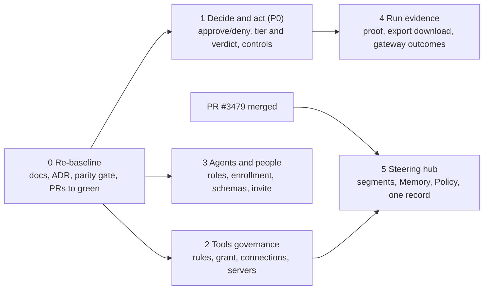

# Mission Control: the build, in six sessions

| | |
|---|---|
| **Status** | Plan |
| **Date** | 2026-09-19 |
| **Baseline** | `origin/main` at `cc8f0b8` |
| **Source of the gaps** | `docs/audits/2026-09-19-mission-control-gap-inventory-review.md`, which corrects `GAP-INVENTORY.md` against head. Session 0 rewrites the inventory itself |
| **Page set** | The routes under `apps/app/src/app/`, with `apps/app/ARCHITECTURE.md` §1.2 as the map. Skills stays in scope until #3297 |
| **How a session runs** | One slash command per session (`/mc-<n>-<name>`) scouts inline, then runs the workflow of the same name from `.claude/workflows/`. Each workflow scouts, builds its lanes in parallel worktrees, integrates them into one PR, and cold-reviews the PR |

## Order and dependencies

Sessions 1, 2, and 3 can run at the same time on separate machines or in separate cloud sessions. They touch different feature lanes and their shared-file hunks (`capability-ui-map.json`, `messages/*.json`, `data/contracts/*`) are kept in per-lane blocks so `git merge` resolves them. Session 4 follows 1. Session 5 follows 2, because its Policy tab links every rule to the auto-approvals editor session 2 builds, and waits for PR #3479 to merge.

| Session | Command | Owns | Class of work | Issues |
|---|---|---|---|---|
| 0 | `/mc-0-rebaseline` | Gap record, cut ADR, spec and architecture notes, twelve capability docs, parity gate proof check, two binding defects, PRs #3479 and #3459 to green | Docs and tooling | #2592, #2957, #3286 (refs) |
| 1 | `/mc-1-decide-and-act` | Approve and deny with reason on Fleet and Run, four-hop chain, eligibility line, tier and verdict columns, no controls on observe runs, pause, resume, cancel from Fleet, steer with a delivery mode, unmetered caveat on Fleet | UI-only over live handlers, one ADR | #2950, #2953, #3285, #2970, #3286, #3304 |
| 2 | `/mc-2-tools-governance` | Auto-approvals tab, grant a mandate, ledger links, mandate page in page-load, connections table and add connection, servers and register server, import from a picked server | UI-only, plus a digest on the rules contract | #2970, #2957 |
| 3 | `/mc-3-agents-and-people` | Assign and revoke roles, revoke and mint enrollment, budget read on the agent, toolbelt input schemas, send an invitation | UI-only, plus one contract field | #2956, #2964, #2953 |
| 4 | `/mc-4-run-evidence` | Proof tab, `get_run_export` and a download route, gateway outcomes on the transcript, tier basis line, cache tile and unmetered caveat on Spend | UI plus one new capability | #2952, #2955, #3304, #3299 |
| 5 | `/mc-5-steering-hub` | Tabs as path segments, one record's page, Memory tab, Policy tab | UI-only, plus provenance fields on the memory contract | #3297, #3395 |

## Already built. Do not rebuild.

The gap inventory of 2026-09-19 predates five PRs that landed the same day. These are on `main` now:

| Item | Where | PR |
|---|---|---|
| Mandate detail page with Change limits and Revoke | `apps/app/src/app/[org]/[ws]/mandates/[mandate]/page.tsx`, `features/mandate/` | #3385 |
| Run chain and seal tab | `features/run/chain.tsx` | #3352 |
| Run fork replay and bisect | `features/run/replay-actions.tsx` | #3352 |
| Run approvals tab (pending and resolved, read-only) | `features/run/run.tsx`, `resolved-approvals.tsx` | #3352, #3467 |
| Spend pricing tab: price book, negotiated rates, unpriced models | `features/spend/pricing.tsx` | #3271 |
| Steering freshness panel with the `autoSync` and `blockStaleRuns` gates | `features/steering/freshness.tsx` | #3276 |
| Loopback model proxy, enforced session budget, real interrupt, base URL enrollment, `gateway` tier computed from routing | `packages/tacho/src/collector/model-proxy.ts` | c3e8dc7, #3332, #3468, #3476 |
| Phase 0: `must` and `should` records reach Claude Code at `SessionStart` | `packages/handlers/src/lib/tacho-steering.ts` | #3289 |
| Stripe Checkout for upgrades and GAU | `features/billing/` | #3392 |

Open PRs that carry work a session would otherwise build:

| PR | Branch | Carries |
|---|---|---|
| #3479 | `mc/creation-wizards` | Skills as a tab of Steering, `/skills` redirect, `propose_skill`, the skill, agent, and record creation wizards |
| #3459 | `mc/repositories-page` | A Repositories page; Settings leaves the workspace menu |

## Not built by any session. Why.

| Item | Waits on |
|---|---|
| Steering Preview (`assembleSteering`) | Phase 1, #3296, ADR-093. No source exists |
| Skills tab content per spec §10.7 (governed files, sync, versions) | Phase 2, #3297, after Phase 1 delivery by sync |
| Ontology notes tab | Phase 2. No contract |
| Definition of done: certificate, checks, Stops, sign a human check | Phase 5 and #2955, which carries `needs:decision` and `needs:rig` |
| Ledger halt token (WL-61) | Backend lane under #2953. Twenty of its twenty-four paths are outside the app, and the disabled state renders the decided copy |
| Agent-scope budgets | An ADR on `billing.budgets` scopes. Session 3 leaves the question in its PR body |
| Spend by provider key and by task | A `get_spend` group the contract does not have. Backend first |
| Audit incidents at org scope, receipts, retention writes | New backend and, for receipts, a store and a decision |
| Connection owner and review date | A `list_connections` output field. Session 2 files it as residue |
| Every item in the cut list | `apps/app/ARCHITECTURE.md` §9, and the ADR session 0 writes |

## Session 0: re-baseline

**Why first.** Every later session reads `GAP-INVENTORY.md`. Today it says Missing for nine things that are Built, cites a repository this tree cannot reach, and does not name the file that enforces app parity. The parity gate also passes a binding whose proof file does not exist.

Lanes:

- **docs.** Rewrite the inventory against head with a Class column and the owning issue per row. One ADR for the 2026-09-14 scope review and its two reversals. A status note under spec §2.1. The Skills and Mandate rows in `ARCHITECTURE.md` §1.2. Twelve `docs/capabilities` files the contracts claim and do not have.
- **parity.** `check_ui_parity.mjs --strict` fails on a proof path that does not exist, with no metadata exception, because `verifications/` is gitignored and `verifiedAt` is self-reported. It also learns an `also` array so one capability can be bound on two pages, which sessions 1, 3, and 5 use. A real test for `get_contract_rate`. An `app` layer and a binding for `get_steering_freshness`.
- **prs.** PRs #3479 and #3459 to green and mergeable. No merge. A sidecar lane: it works on those PRs' own branches, and the workflow keeps it out of the session's integration.

Done when:

- [ ] `GAP-INVENTORY.md` has no row the review refutes and every row has a class and an owner
- [ ] The scope-review ADR exists and `ARCHITECTURE.md` §9 links it
- [ ] Twelve capability docs exist and `check:contracts` passes
- [ ] `check_ui_parity.mjs --strict` fails on a dangling proof and validates `also` entries, with tests
- [ ] #3479 and #3459 are green and mergeable, or the blockers are named

## Session 1: decide and act

Landed in PR https://github.com/macanderson/oxagen/pull/3516

**Why P0.** Two pages draw the approval queue and neither can decide. The assistant flyout sends people to Fleet to approve, and nothing there approves. Fleet has no tier column while ADR-095 says the vocabulary rule applies now and Phase 4 is about to change what `gateway` means. Every piece is a component over a handler that already ships and a kernel seam that is already tested.

Lanes:

- **approve.** Decision 1 of #2950 as an ADR. `resolve_approval` gains the `app` layer, a server action, a dialog with the four hops and the eligibility line, on the Fleet panel and the Run approvals tab. The mapper carries `chain.rule`, `mandateId`, and `autoEligibility`. The waiting tile counts every pending approval.
- **columns.** Tier and Verdict on the Fleet table from recorded values. No controls on observe-tier runs (#3285). The unmetered-runs caveat beside the cost total (#3304).
- **controls.** Pause, resume, cancel on Fleet rows through `dispatch_command` with a run target. Steer on Run sends a delivery mode.

Done when:

- [x] An approval can be approved or denied with a reason from Fleet and from Run
- [x] Each card shows who asked, which agent, which action, which rule, and the eligibility line
- [x] Fleet shows the enforcement tier and the verdict for every row, recorded values only
- [x] Observe-tier runs offer no controls
- [x] A live wrapped run can be paused, resumed, and cancelled from Fleet
- [x] Steer carries a delivery mode
- [x] `resolve_approval`, `get_auto_eligibility`, and `dispatch_command` (Fleet) are bound with real proofs

## Session 2: tools governance

Landed in PR https://github.com/macanderson/oxagen/pull/3519 (connections, servers, and the ledger links).

**Why.** Five approval-rule contracts, `grant_mandate`, three connection contracts, and two server contracts are registered and reachable only through the API. The accountable office has no UI for the one write the mandates ledger exists for.

Lanes:

- **rules.** The auto-approvals tab: list, create, edit, enable, disable, delete, explain eligibility. The write replaces the whole list and the contract has no revision, so the lane first adds a digest to the list read and an `expectedDigest` the set handler checks under its lock, through the parity chain. A client-side id comparison cannot close that race.
- **grant.** Grant a mandate from the Tools ledger and from a pending request on the agent page, prefilled, with the parked-for-approval state shown honestly. Ledger rows link to the mandate page. The mandate page joins page-load.
- **connections.** A connections table with a detail drawer and add connection. Servers in the registry with register server, and import picks a server from the list.

Done when:

- [ ] Rules can be listed, created, edited, enabled, disabled, deleted, and explained
- [x] A mandate can be granted from Tools and from a request
- [ ] Every ledger row opens the mandate page, and page-load walks it (the rows link; the `page-load` row waits on the e2e seed, `apps/app/ARCHITECTURE.md` 2026-09-19 known issue)
- [x] Connections are listed and can be added; servers are listed and registered
- [ ] Eleven bindings with real proofs (ten bound; `get_auto_eligibility` is the eleventh and is still unbound)

## Session 3: agents and people

Landed in PR https://github.com/macanderson/oxagen/pull/3517

**Why.** The agent page reads roles and hosts and cannot write either. The toolbelt shows rules without the schemas the spec pairs them with. People lists invitations and cannot send one.

Lanes:

- **roles.** Assign and revoke on the identity tab.
- **enrollment.** Revoke a host. Mint an enrollment token and show the command once. A read-only budget panel with its basis, and the NotBacked line for agent-scope budgets.
- **schemas.** `get_agent_toolbelt` carries each tool's input schema and digest. The toolbelt renders them. Read capability schemas from registered contract inputs, MCP schemas from the descriptors used in materialization with server identity, and versioned schemas from the resolved version. Contract change, whole parity chain.
- **invite.** Send an organization invitation. The handler records an org role and no workspace, so there is no workspace picker and the copy claims nothing about workspaces. A repeat for a pending email returns the existing invitation, shown as already invited.

Done when:

- [x] A role can be assigned and revoked on the agent page
- [x] An enrollment can be revoked and a new one minted from the page
- [x] The agent shows the budget it runs under with its basis
- [x] The toolbelt shows each tool's input schema and digest
- [x] An organization invitation can be sent from People
- [x] Five bindings with real proofs; the toolbelt contract change is documented

## Session 4: run evidence

**Why.** `get_run_proof` ships and nothing renders it. `export_run` queues a job and nothing reads the bundle back. The proxy seals budget refusals and interrupts and the transcript does not show them. Spend totals leave Codex and Stella runs out without saying so.

Lanes:

- **proof.** A Proof tab that renders the recorded proof and one NotBacked line for the Phase 5 items.
- **export.** `get_run_export` through the whole parity chain, using the stored status vocabulary (queued, building, ready, failed), a download route over blob storage, and the export id on Run becomes a download link when ready.
- **gateway.** The transcript read gains the gateway fields the proxy records (reason code, interrupted, binding, tier basis), then the transcript renders budget refusals, interrupts, and each model call's binding and tier basis. The tier's basis beside the tier word. The cache tile and the unmetered caveat on Spend.

Done when:

- [ ] The Proof tab shows the recorded proof, and NotRecorded where there is none
- [ ] An exported run can be downloaded from Run, and its status reads back on every surface
- [ ] A run that hit its session budget or was interrupted says so with the frame
- [ ] The tier word carries what computed it
- [ ] Spend shows the cache hit rate and names unmetered runs beside every total

## Session 5: steering hub

**Why.** Spec §10.7 puts every gate and every memory on one screen. The tabs are query values today. The Memory tab is three registered capabilities with no page. The Policy tab is three lists that exist elsewhere.

**Depends on session 2.** The Policy tab links every enabled rule to the auto-approvals editor that session 2 builds. Without it the link lands on a page that cannot edit the rule.

**Freeze.** ADR-091 §6 forbids new governance ceremony until #2592 records a merged record seen in a real run. This session adds tabs and reads and hands "propose as a record" to the existing flow. It adds no proposal state, check, or review step.

Lanes:

- **segments.** Tabs as path segments through one optional catch-all that replaces `steering/page.tsx` (Next.js refuses both at the same level), with `records` as the default, the seven tabs in spec order, NotBacked lines for Ontology and Preview, the old `?tab=` values redirected inside the page (the proxy's legacy table sees only the pathname), and a page for one published record (#3395).
- **memory.** What agents remembered, with provenance as the record carries it. The memory record holds a free-text `source` and no frame id today, so the lane adds optional provenance fields to the contract where the store can fill them and renders NotRecorded where it cannot. Retire, demote, propose as a record.
- **policy.** Add cursor pagination through the mandate and kill-switch contracts, handlers and parity chain; consume all pages and report page failures. Test beyond the current 100-mandate and 200-switch caps. Active mandates, enabled rules, and switches that are on, each linking to its editor, with the gate notice named as Phase 1.

Done when:

- [ ] Every tab has a path and `/steering` renders Records
- [ ] A published record has its own page and page-load walks it
- [ ] Memories are listed with provenance and can be retired, demoted, or proposed
- [ ] The Policy tab lists every active gate with a link to its editor
- [ ] Four bindings with real proofs

## Workflow shape

Every `mc-*` workflow has the same four phases and the same preamble, copied into each file because a script cannot import another.

1. **Scout.** One read-only agent checks each lane against `origin/main` and returns `still_open`, the file and line facts the builder needs, and the open PRs that overlap. A lane that already shipped is skipped and logged. `dryRun: true` stops here.
2. **Build.** One agent per lane, in parallel, each in its own worktree on `mc/<session>-<lane>` from `origin/main`, owning only its paths, pushing after every step, opening no PR.
3. **Integrate.** Validate each lane's branch and SHA, then use a read-only agent to verify the published remote head. Invalid, absent or changed heads stop integration. One agent merges the verified lane commits into `mc/<session>`, merges `origin/main`, reads the whole diff against this document, runs the generators, updates this document's boxes and `ARCHITECTURE.md` §1.2, opens the PR ready for review with the template filled, and drives CI green for up to four rounds. It does not merge.
4. **Review.** One agent cold-reviews the PR, fixes every P0 and P1 on the branch, carries P2 and below into one residue issue by default, splitting genuinely unrelated changes under SCR-003, and replies on and resolves each carried thread per AGENTS.md.

A lane marked `integrate: false` is a sidecar: it works on branches that are not the session's and its result is reported, never merged.

Args: `worktreeRoot` (default `../oxagen-worktrees`), `skipLanes` (lane ids), `dryRun`, `mergeMain`.

**Harnesses.** The Workflow tool is Claude Code's. Codex, Cursor, and Stella read the same command text through the `.cursor/commands` symlink and `AGENTS.md`, and run a session as the four phases in order with their own subagents, one lane at a time where they cannot run lanes in parallel. The lane prompts in each script are plain text and can be pasted.

The rules every agent carries are in the `RULES` block at the top of each script: one test file in isolation at most, never a suite; never `main`; the parity chain as one change; every UI state; recorded values only on trust badges; fix what you meet.

## After session 5

What remains is backend first: Phase 1 (#3296) unblocks Preview and the gate notices, Phase 2 (#3297) the Skills tab content, Phase 5 (#3300) the definition of done. Spend by provider key and by task, agent-scope budgets, org-scope incidents, and receipts each need a contract or a decision before a page. When one lands, add a session here rather than widening one of these six.
